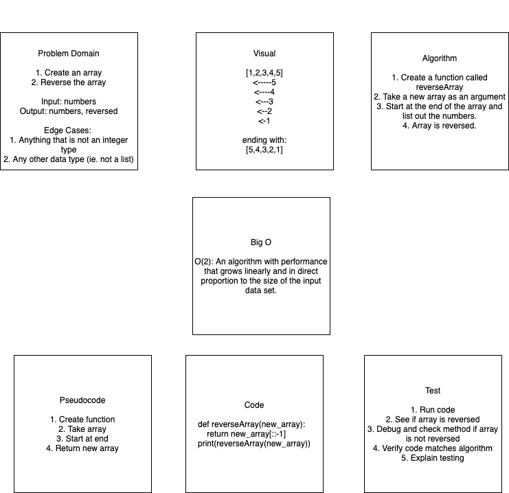

# Reverse an Array
<!-- Short summary or background information -->
First time white boarding

## Challenge
<!-- Description of the challenge -->
set up repo
figure out which white board to use
submit

## Approach & Efficiency
<!-- What approach did you take? Why? What is the Big O space/time for this approach? -->
We paired white boarded the problem and then step by step handled the white boarding problems.

## Solution
<!-- Embedded whiteboard image -->

# Partner
Grace Choi